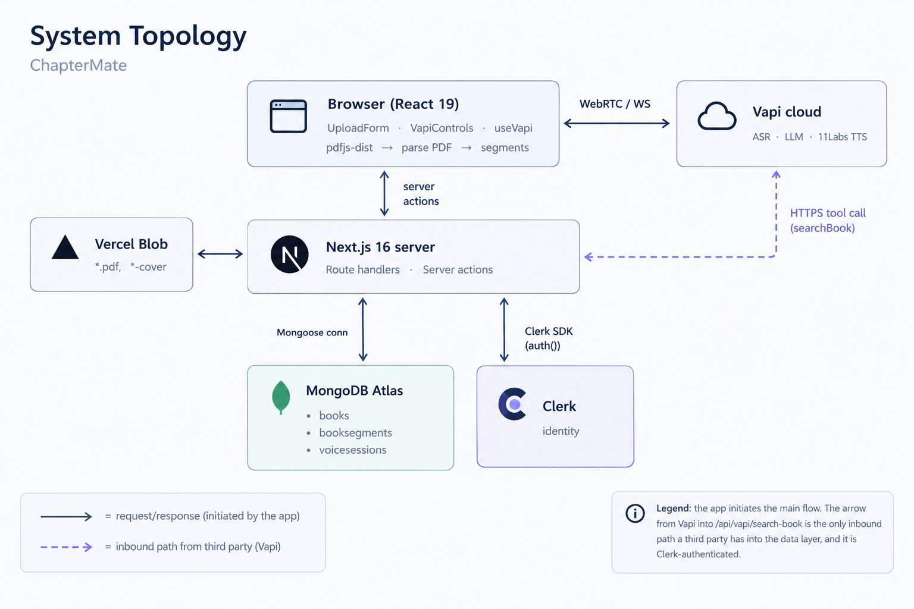
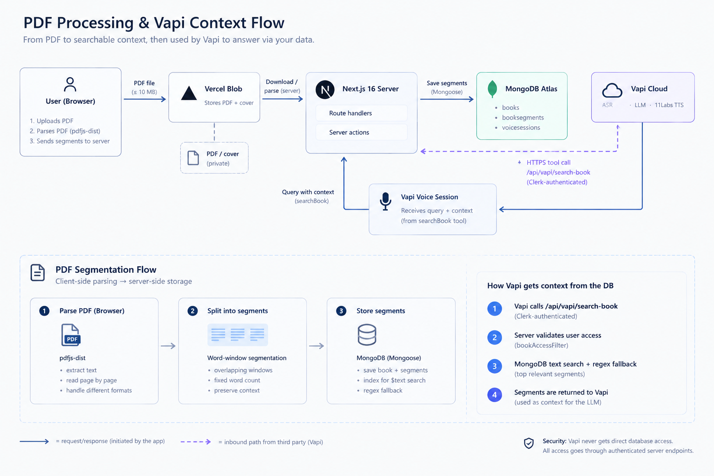
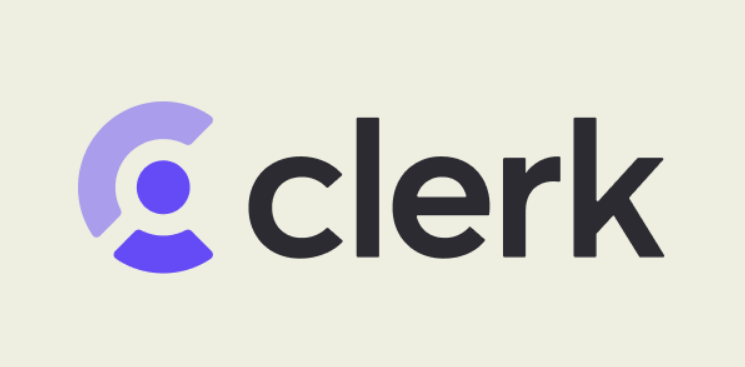
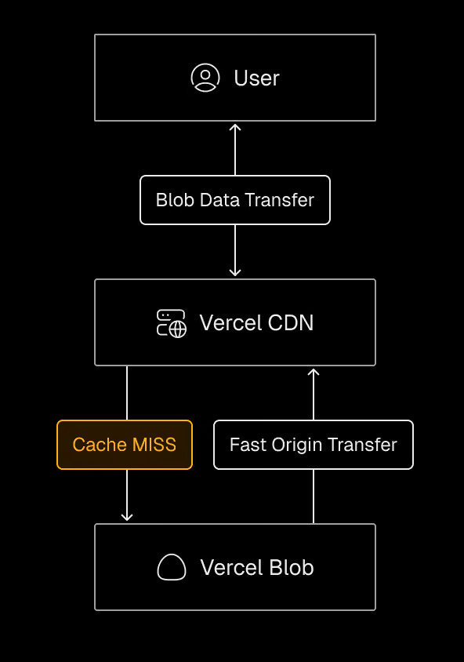

<p align="center">
  
</p>

<h1 align="center">ChapterMate</h1>

<p align="center">
  <b>Turn any PDF book into a voice you can actually talk to.</b><br/>
  Upload a PDF, get a library entry, and open a live spoken conversation with the text —
  grounded in <i>your</i> pages, not in a model's memory.
</p>

<p align="center">
  <a href="https://nextjs.org"></a>
  <a href="https://react.dev"></a>
  
  <a href="https://tailwindcss.com"></a>
  <a href="https://ui.shadcn.com"></a>
</p>

<p align="center">
  <a href="https://www.mongodb.com/atlas"></a>
  <a href="https://mongoosejs.com"></a>
  <a href="https://clerk.com"></a>
  <a href="https://vapi.ai"></a>
  <a href="https://vercel.com/storage/blob"></a>
  <a href="https://posthog.com"></a>
</p>

<p align="center">
  <a href="https://jestjs.io"></a>
  <a href="https://github.com/zannunakiz/ChapterMate/actions"></a>
  
</p>

<p align="center">
  <i>No account needed to try it — three classics (Jane Eyre, The Great Gatsby, Dracula) ship as
  <b>public sample books</b> and can be talked to while signed out.</i>
</p>

---

## 🏗️ System Design

<p align="center">
  
</p>

<p align="center">
  <sub>
    <b>One upload, end to end:</b> the browser parses the PDF with <code>pdfjs-dist</code> → a Server Action re-resolves
    <code>userId</code> from Clerk → the PDF and cover go straight to <b>Vercel Blob</b> through an authorised token → the text
    lands in <b>MongoDB Atlas</b> as ranked segments.<br/>
    Then one call: <code>startVoiceSession</code> → <b>Vapi</b> (ASR · LLM · ElevenLabs TTS) → the <code>searchBook</code> tool calls
    <i>back</i> into the app → an ownership-checked <code>$text</code> query → grounded speech.
  </sub>
</p>

---

## 🧭 Engineering Point

<p align="center">
  
</p>

<p align="center">
  <sub>
    The whole codebase exists to make three things work: <b>PDF intake</b> parsed in the browser, <b>segmentation</b> into an
    index-backed Mongo corpus, and <b>Vapi voice orchestration</b> that re-authorises every retrieval request.
    Deep dive: <a href="./documentation/EngineeringPoint.md">EngineeringPoint.md</a> ·
    <a href="./documentation/SystemDesign.md">SystemDesign.md</a>
  </sub>
</p>

---

## 📚 Table of Contents

| | Section |
|---|---|
| 🌱 | [About](#-about) |
| 🚀 | [Get Started](#-get-started) |
| 🔌 | [Integrations](#-integrations) |
| ✨ | [Features](#-features) |
| 🧱 | [Tech Stack](#-tech-stack) |
| 🛠️ | [Engineering Highlights](#-engineering-highlights) |
| 🗂️ | [Project Structure](#-project-structure) |
| 📜 | [Scripts](#-scripts) |
| 🧪 | [Tests & CI](#-tests--ci) |
| 🤝 | [Contributing](#-contributing) |
| 📄 | [License](#-license) |
| 🌐 | [Live](#-live) |

---

## 🌱 About

ChapterMate is a **voice-first reading companion**: you bring a PDF, it becomes a book you can *speak to*.

Three moments make up the product:

1. **Upload** — a title, an author, a voice and a PDF. The file is parsed *in the browser*, stored in Vercel Blob, and fanned out into a searchable corpus in MongoDB.
2. **Library** — your own books sit beside three seeded public classics, each with its cover, assigned voice and segment count.
3. **Session** — open a book and talk. The agent answers from *that book*, retrieving the relevant pages on every turn.

<table>
<tr><td width="50%" valign="top">

**For the reader**
- Three public classics you can talk to **without signing in**
- Your own PDFs, private to your account by construction
- A live transcript, a call timer and a voice per book
- An animated marketing surface that keeps its claims honest

</td><td width="50%" valign="top">

**For the engineer**
- PDF parsing kept off the server (`pdfjs-dist` in a worker, in the browser)
- A 500-word sliding-window corpus with a `$text` index and a regex fallback
- Uploads that bypass serverless memory via **client tokens**
- Retrieval that re-authorises the caller on **every single tool call**

</td></tr>
</table>

---

## 🚀 Get Started

**Requirements:** Node.js **22+** (the version CI pins), npm, and accounts for **MongoDB Atlas**, **Clerk**,
**Vercel Blob** and **Vapi**. **PostHog** is optional — analytics stay switched off when it is not configured.

### 1 — Clone the repository

```bash
git clone https://github.com/zannunakiz/ChapterMate.git
cd ChapterMate
```

### 2 — Install dependencies

```bash
npm install
```

### 3 — Configure the environment

```bash
cp .env.example .env.local     # macOS / Linux
copy .env.example .env.local   # Windows (cmd / PowerShell)
```

Every key is documented inline in `.env.example`, grouped by provider.

### 4 — Seed the sample books

```bash
npm run db:seed-samples   # uploads the bundled PDFs/covers to Blob, then writes books + segments
```

### 5 — Run it locally

```bash
npm run dev                # http://localhost:3000
```

<sub>The seed script is the server-side twin of the browser pipeline: same 500/50 splitter, same schema, but it
parses with <code>pdfjs-dist/legacy</code> and <code>disableWorker: true</code> because there is no DOM.</sub>

---

## 🔌 Integrations

### 🗄️ Data — MongoDB Atlas, modelled in Mongoose

<p align="center">
  
</p>

Three collections carry the whole product: **`books`** (metadata + Blob keys), **`booksegments`** (the searchable
windows) and **`voicesessions`** (one row per call, closed with `endedAt`/`durationSeconds`).

- Every index is **compound and `bookId`-leading** — `{ bookId, segmentIndex }` unique (ordering + idempotency),
  `{ bookId, content: 'text' }` (search), `{ bookId, pageNumber }` (reserved for page citations). A search can
  never fan out across the collection.
- The connection is cached on `globalThis`, so hot reloads and concurrent route invocations share one pool; a failed
  connect clears the cached promise so the next caller retries instead of inheriting a poisoned one.
- `bufferCommands: false` plus explicit timeouts means an unreachable cluster **fails fast** instead of silently queueing.
- `mongodb+srv://` needs SRV resolution before it can connect at all, which some networks quietly break
  (`querySrv ECONNREFUSED`). `lib/dns-bootstrap.ts` probes the resolver and only then falls back to public DNS —
  wired into `instrumentation.ts`, the connection module and the standalone scripts, so no entry point is left broken.

### 🔐 Identity — Clerk at the edge, and again on every action

<p align="center">
  
</p>

`proxy.ts` runs `clerkMiddleware` and marks the landing page, the library, the sessions and the auth pages public
while `auth.protect()` guards everything else — so the upload form is never reachable signed out. But the edge is
treated as the *first* gate, never the only one: **every Server Action and route handler re-resolves `userId` with
`auth()`**, and the client's identifier is never trusted, in either direction.

- Ownership is pushed **inside** the query (`Book.findOne({ _id, ...bookAccessFilter(userId) })`), so an unreadable
  document is never loaded in the first place — no "fetch then check" gap.
- Guests are not a special case: `SAMPLE_BOOKS_CLERK_ID = "sample-books"` makes public books readable by everyone
  through the *same* predicate that protects private ones.
- Rejected requests never open a database connection — the tests assert exactly that.

### 📦 Assets — Vercel Blob, uploaded by token exchange

<p align="center">
  
</p>

The PDF and the cover are the only binaries in the system, and they never pass *through* Next.js. The route handler
only **authorises**: `handleUpload` → `onBeforeGenerateToken()` re-checks the Clerk session and pins
`allowedContentTypes` (`application/pdf`) and `maximumSizeInBytes` (10 MB) before signing a client token. The browser
then `PUT`s the bytes straight to Blob.

That single decision buys a lot: large files never occupy a serverless function's memory or its much shorter
body-size limit, the server stays stateless, and the database only ever stores the URLs it references —
`fileURL`/`fileBlobKey` and `coverURL`/`coverBlobKey`. Deleting a book deletes its Blob objects too.

---

### 🎙️ Voice — Vapi orchestrates, the app decides

<p align="center">
  
</p>

Vapi supplies the speech loop (ASR · LLM · ElevenLabs `11labs` TTS); `hooks/useVapi.ts` is the adapter that owns a
single SDK client, maps the provider's event stream onto an explicit status
(`idle → connecting → starting → listening → thinking → speaking`), keeps the transcript and guarantees the session
gets closed.

The interesting half is the return path. The assistant's `searchBook` tool calls **back into the app**, where the
handler resolves the viewer from Clerk and runs an ownership-checked query — the tool call is authorised per request
rather than trusted because a prompt said so. Retrieval prefers a `$text` search ranked by `textScore`, and degrades
to a keyword-regex pair (all keywords first for precision, any keyword second for recall) if the text index is
missing, so a differently-provisioned cluster still answers. Results are narrowed to ~5 segments — roughly 2 500
words, a deliberate context budget — and returned as a plain string, because that is what the model consumes.

### 📊 Observability — PostHog, initialised exactly once

<p align="center">
  
</p>

PostHog is initialised in `instrumentation-client.ts` — Next.js' own client hook — so no provider, effect or
double-render can run it twice. Automatic pageviews are **disabled on purpose**: `components/posthog-page-view.tsx`
is the single source of truth, firing one `$pageview` per App Router route *and* query-string change.

Two details that matter: a module-level guard suppresses the duplicate a double-invoked dev effect would send, and
the session slug is **masked** before capture (`/books/session/[slug]`) — because a slug is derived from a book
title, and private titles must not leave the app. Initialisation is skipped entirely when no project token is set,
so local development logs no SDK error, and `@vercel/analytics` runs alongside it.

### 🧪 Confidence — Jest, with no database in sight

<p align="center">
  
</p>

**3 suites, 20 cases, and no network or cluster involved.** The rules live in plain modules — `lib/book-access.ts`,
`lib/feature-flags.ts`, `lib/utils.ts` — so the suites execute the real functions while only the boundary
(Clerk, Mongoose, the models, `@vercel/blob`) is mocked. The sharpest assertions are the negative ones: a signed-out
caller is refused **without a connection being opened**, and a book owned by someone else is never loaded, let alone
returned. `ts-jest` maps the `@/*` alias the same way the app does, so the tests import production code, unmodified.

---

## ✨ Features

<table>
<tr><td width="50%" valign="top">

**📚 A library that is yours**
- Upload a PDF (≤10 MB) with a title, author and voice (Zod-validated in the UI *and* on the server)
- Duplicate titles are refused before a single byte is uploaded; a unique `slug` index is the backstop
- Covers are optional — page 1 is rendered to a canvas and exported as JPEG when you skip it
- A hard 10-book limit per account, surfaced in the UI instead of as a failed mutation
- Delete once: the book, its segments and its Blob objects all go together

**🗣️ Voice conversations**
- Live spoken dialogue with ASR, an LLM and ElevenLabs TTS through Vapi
- Six curated voices, one pinned per book, so a book always sounds like itself
- A rolling transcript, a call timer and honest connection states
- Sessions are recorded *before* audio starts, and closed on hang-up, error or unmount

</td><td width="50%" valign="top">

**🎯 Grounded answers, not vibes**
- Every question is answered from segments retrieved out of *that* book
- `$text` search first (index-ranked), keyword-regex second (precision → recall)
- ~5 segments per turn: a deliberate context budget, not a dump
- Spoken filler words are stripped with a curated stop-word set before the query runs
- Retrieval re-checks access on every call — a tool call cannot widen the caller's reach

**🧪 Engineering by default**
- 20 unit tests over the pure rules: access policy, feature-flag parsing, action fences
- Three independent CI jobs (`unit`, `lint`, `build`) — a red check names what broke
- PostHog pageviews with slug masking, so private titles never leave the app
- Feature flags let the same UI run on bundled data or live data without a fork

</td></tr>
</table>

---

## 🧱 Tech Stack

**Application**

| Layer | Choice | Why it is here |
|---|---|---|
| Framework | **Next.js 16** (App Router, RSC) | One runtime for UI *and* backend: Server Components read, Server Actions write — no REST layer to keep in sync |
| UI runtime | **React 19** | Concurrent rendering, Suspense boundaries and a hook-owned voice client |
| Language | **TypeScript 5** (strict, `@/*` alias) | One source of truth from the Mongoose schema to the JSX |
| Styling | **Tailwind CSS v4** + `tw-animate-css` | Token-driven theme with zero runtime CSS |
| Components | **shadcn/ui** over **Radix primitives** | Accessible, copy-owned components — keyboard behaviour included, no opaque dependency |
| Motion | **Framer Motion** | Entrance choreography that honours `prefers-reduced-motion` |
| Landing surface | Hand-rolled **canvas** scenes + Framer Motion | Animated, dependency-light marketing sections that stay honest about the product |
| Icons / toasts | **lucide-react**, **sonner** | Icon set and toast queue |

**Data & identity**

| Layer | Choice | Why it is here |
|---|---|---|
| Database | **MongoDB Atlas** | Document-shaped corpus: a book *is* a list of segment documents, and `$text` search is built in |
| ODM | **Mongoose 9** | Schemas, compound/index declarations and `textScore` sorting in one place |
| Identity | **Clerk** (`@clerk/nextjs`) | Edge middleware for the perimeter, `auth()` for the per-request truth |
| Files | **Vercel Blob** (`@vercel/blob`) | Client-token uploads so binaries never transit a serverless function |

**Platform & quality**

| Layer | Choice | Why it is here |
|---|---|---|
| PDF parsing | **pdfjs-dist** (browser + Node legacy build for seeding) | Text extraction and page-1 cover rendering without a server-side worker |
| Voice | **Vapi** (`@vapi-ai/web`) + ElevenLabs voices | ASR, LLM turn-taking and TTS behind one SDK; the retrieval contract stays ours |
| Validation | **Zod + react-hook-form** | One schema drives the form, the client gate and the server check |
| Analytics | **PostHog** + **Vercel Analytics** | Route-aware pageviews, initialised in an instrumentation hook |
| Tests | **Jest 30 + ts-jest** | 3 suites / **20 cases** over the pure rules — no database, no network |
| CI | **GitHub Actions** — `unit-tests`, `lint`, `build` | Three independent, individually-required checks |
| Fonts | **`next/font`** (Instrument Sans, Instrument Serif, JetBrains Mono) | Self-hosted, zero layout shift, mapped to CSS variables |

---

## 🛠️ Engineering Highlights

Everything below is enforced by code, not by convention.

### 1. PDF parsing happens in the browser — the server never sees a byte

The most deliberate choice in the upload path: **no PDF ever reaches the server as a stream.** `parsePDFFile()`
runs `pdfjs-dist` in the client, so the Next.js runtime never pays for a parser, a worker or a large file buffer.

```
UploadForm.submit(data)
  1. checkBookExist(title)   ─ server action ─►  duplicate title is a FAILURE, checked before any upload
  2. parsePDFFile(pdfFile)   ─►  arrayBuffer → getDocument() → page 1 rendered @ scale 2 → JPEG q0.8
                                 ∀ page: getTextContent().items[].str → join(' ')  + "\n"
                                 splitIntoSegments(fullText) → TextSegment[]
                                 no text at all? abort — scanned PDFs validate fine and have nothing to index
  3. upload pdf     ─► POST /api/upload        (token → browser PUTs directly to Vercel Blob)
  4. upload cover   ─► POST /api/upload/cover  (your image, or the generated page-1 JPEG)
  5. createBook({ …blob urls… })   ─ server action ─► re-checks userId, slug clash, the 10-book limit
  6. saveBookSegments(bookId, parsedPDF.content)   ─ server action
```

The `.filter(item => 'str' in item)` guard is not decoration: `getTextContent().items` is a union of text runs and
marked-content markers, so a blind `.map(item => item.str)` would emit `undefined` and corrupt the corpus.

### 2. Splitting a PDF into segments — the shape of the searchable corpus

`splitIntoSegments(text, 500, 50)` is a **word-window** splitter, not a character or sentence splitter:

```
words = text.split(/\s+/).filter(Boolean)

start = 0                                     ┌─ 500 words ─┐
while start < words.length:                   │             │
    end   = min(start + 500, words.length)    ▼             ▼
    emit  { text: words[start..end].join(' '),   ────────────────────
            segmentIndex, wordCount }             ←50→ overlap ←→
    if end === words.length: break               ────────────────
    start = end - 50                                  ▲        ▲
                                                      └ 450 new ┘
```

- **500 words** is the retrieval unit: long enough to carry a scene's context, short enough that five of them
  (~2 500 words) fit comfortably in the assistant's context window.
- **50-word overlap** stops a sentence from being sliced exactly in half and becoming unfindable in *both*
  segments — storage traded for recall, on purpose.
- The function is **total and defensive**: `segmentSize <= 0` and `overlapSize >= segmentSize` throw, and the loop
  always terminates because `start` strictly increases.
- `segmentIndex` is gapless and 0-based, which is exactly what the `{ bookId, segmentIndex }` **unique** index
  polices — a partially-written batch can never silently overwrite another book's ordering.

Persistence is what makes re-uploads boring:

```
saveBookSegments(bookId, content)
  auth() ─────────────► no userId ⇒ failure        (no connection opened)
  isValidObjectId ────► malformed ⇒ "Book not found."
  Book.findOne({ _id, clerkId: userId })            ← ownership INSIDE the query
  BookSegment.deleteMany({ bookId })                ← idempotent: retry-safe by design
  BookSegment.insertMany(segments)                  ← one document per window
  Book.updateOne({ _id, clerkId }, { totalSegments })
```

`deleteMany` runs **before** `insertMany` and is scoped to `bookId` only (ownership was already proven by the
`findOne`), so the whole operation is safe to retry. The seed script reuses the same splitter and schema on the
server side — a second implementation would have been a second chance to drift.

---

### 3. Blob uploads by token exchange — bytes that skip the server

```
browser ──POST /api/upload──► handleUpload
                                └─ onBeforeGenerateToken()
                                     auth() must return a userId     → else 401
                                     allowedContentTypes: application/pdf
                                     maximumSizeInBytes: 10 MB
                                     addRandomSuffix: true
                                     tokenPayload: { userId }
browser ──────────── PUT bytes ───────────────────────► Vercel Blob
```

`handleUpload` only **authorises**; nothing is proxied. The browser exchanges an authorised token for a direct
upload, so a 10 MB PDF never occupies a serverless function's memory or its much shorter body-size limit, while
Clerk identity, MIME type and maximum size are still enforced server-side at the one moment that matters. The
database stores only what it can point at — `fileURL`/`fileBlobKey` and `coverURL`/`coverBlobKey` — and the cover
route applies the same guard with a 1 MB / image-only envelope.

### 4. Vapi is treated as an unreliable I/O boundary

A hosted voice platform is a network dependency you do not control, so `hooks/useVapi.ts` is an explicit adapter
rather than a sprinkle of event handlers. It owns **one** lazily-created SDK client per page (a missing key fails at
call time with a clear message instead of at build time), and it maps the provider's event stream onto a status the
UI can reason about:

```
idle ─► connecting ─► starting ─► listening ⇄ thinking ⇄ speaking ─► idle (call-end)
```

Two guarantees come out of that design. First, **the session row exists before audio flows** — `startVoiceSession`
writes to Mongo, returns a session id, and only then does the call start, so a dropped connection can still be
accounted for. Second, the session is always closed: hang-up, error and unmount cleanup all call `endVoiceSession`,
which is filtered by the owner, so nobody can close — or forge the duration of — someone else's session.

The part recruiters usually ask about is the retrieval bridge, because it inverts the usual direction of traffic:
the assistant's `searchBook` tool calls **back into the app**, and that handler resolves the viewer from Clerk before
touching the database. A tool call is a request like any other, so it is authorised like any other — access is never
inferred from what the prompt claims.

```
query ─► extractKeywords()   lowercase → strip punctuation → drop words ≤ 2 chars
                             → drop ~90 stop-words (filler + "book / author / chapter / tell me")
                             → a Set, so no keyword is searched twice
       │
       ├─ keywords.length === 0 ──────────────────────► empty result, honestly
       ├─ $text { $search } .sort(textScore) .limit(5)  ← PRIMARY, index-backed
       │      throws (no text index) or 0 hits ▼
       ├─ PASS 1  content ~ /k1/i AND /k2/i …           ← ALL keywords (precision)
       └─ PASS 2  content ~ /k1/i OR  /k2/i …           ← ANY keyword, ranked in JS (recall)
```

Three properties fall out of it: it **degrades instead of failing** (a cluster without a text index still answers),
it **prefers precision then recall**, and it is **bounded** — five segments and a narrow projection, so the response
never carries `clerkId` or anything else the model does not need. Regex keywords are escaped before becoming
patterns, so a spoken phrase containing `.` or `*` cannot turn into a pathological expression.

### 5. Feature flags — one UI, two data sources

`lib/feature-flags.ts` is deliberately tiny and deliberately **server-only**:

```ts
isFeatureEnabled(value, fallback = false)   // true | 1 | yes | on  → true, anything else → false

isDummyBooksEnabled()  // FF_DUMMY_BOOKS — render bundled sample data instead of the database
isDummyFormEnabled()   // FF_DUMMY_FORM  — simulate the upload/save flow
```

Because the helpers read plain (non-`NEXT_PUBLIC_`) variables, the flags are resolved on the server and passed down
as props — the client bundle never gets to decide what it is allowed to see, and no flag value is shipped to the
browser. Parsing is strict (only four affirmative spellings count) and the fallback is explicit, which is exactly
what `__tests__/feature-flags.test.ts` pins down. The result: the same components can run against seeded books or a
live library, and demo/offline modes are a configuration change rather than a fork in the codebase.

### 6. Quality gates

| Gate | What it proves |
|---|---|
| `npm run test:unit` | The access policy, feature-flag parsing and every action fence: signed-out rejection, forged identifiers, the 10-book limit, slug collisions, ownership-scoped reads |
| `npm run lint` · `npm run build` | ESLint 9 (flat config) and a production build — the build doubles as a TypeScript / routing contract check |
| GitHub Actions | Three **independent** jobs, so a lint failure can never hide a test failure |
| `auth()` before I/O | Authorisation is asserted to happen *before* a database connection is opened — the cheapest possible rejection |

---

## 🗂️ Project Structure

```
ChapterMate/
├── app/
│   ├── page.tsx                    # Landing page (marketing sections)
│   ├── books/                      # Library grid + "add book" upload surface
│   │   └── session/[slug]/         # The live voice session for one book
│   └── api/                        # Upload routes (PDF, cover) + the Vapi search bridge
├── components/
│   ├── landing/                    # Animated marketing sections (canvas + Framer Motion)
│   ├── UploadForm.tsx              # PDF intake: validate → parse → upload → persist
│   ├── VapiControls.tsx            # Call UI driven by the useVapi state machine
│   ├── Transcript.tsx              # Live conversation log
│   └── ui/                         # shadcn/ui primitives
├── hooks/
│   └── useVapi.ts                  # One SDK client, an explicit status machine, session bookkeeping
├── lib/
│   ├── actions/                    # Server Actions — auth() → rules → database
│   ├── book-access.ts              # The single access policy (guests, owners, sample books)
│   ├── feature-flags.ts            # Server-only FF_DUMMY_* parsing
│   ├── dns-bootstrap.ts            # SRV resolver fallback for restrictive networks
│   ├── schema.ts                   # Zod upload schema (shared by the form and the server)
│   ├── samples/                    # Bundled PDFs + covers used by the seed script
│   └── utils.ts                    # parsePDFFile, splitIntoSegments, slug + serialisation helpers
├── database/
│   ├── mongoose.ts                 # Cached global connection with fail-fast timeouts
│   ├── models/                     # book · book-segment · voice-session schemas and indexes
│   └── seed-samples.mjs            # Server-side twin of the browser pipeline
├── __tests__/                      # Access policy, action fences, feature flags
├── public/documentation/           # The images in this README
└── documentation/                  # SystemDesign.md · EngineeringPoint.md · README reference
```

<blockquote>
The split is deliberate: <b>pure rules stay importable</b> (`lib/book-access.ts`, <code>lib/feature-flags.ts</code>,
<code>splitIntoSegments</code>) so they can be tested without a database or a browser;
<b>Server Actions own the framework boundary</b> (identity, validation, orchestration); and
<b>the database layer owns indexing and connection policy</b> and nothing else.
</blockquote>

---

## 📜 Scripts

| Script | Purpose |
|---|---|
| `npm run dev` | Next.js dev server with HMR |
| `npm run build` / `npm run start` | Production build and serve |
| `npm run lint` | ESLint 9 (flat config, `eslint-config-next`) |
| `npm run test:unit` | Jest — access policy, action fences, feature flags |
| `npm run db:seed-samples` | Upload the bundled sample books to Blob and index their segments |
| `npm run db:check-voices` | Read-only diagnostic: each book's persona and the voice it resolves to |
| `npm run db:clear` | Drop the database |
| `npm run test:limit` | Exercise the 10-book rule end to end |

---

## 🧪 Tests & CI

| Suite | Cases | Focus |
|---|:--:|---|
| `__tests__/book-access.test.ts` | 3 | The policy table itself: a signed-out visitor is denied a private book, an owner is allowed but another signed-in user is not, and guest sessions are attributed to the `sample-books` owner |
| `__tests__/book-action.test.ts` | 16 | `createBook` refuses a signed-out caller **and** a forged identifier without opening a connection, refuses book #11, uses the authenticated owner id and reports a taken slug without echoing the other document; `saveBookSegments` enforces ownership and rejects malformed ids before any write; `searchBookSegments` reads nothing for an unreadable book and scopes the query per viewer |
| `__tests__/feature-flags.test.ts` | 1 | `isFeatureEnabled` accepts `true/1/yes/on`, rejects everything else, and honours the fallback for missing or blank values |

**20 cases, 3 suites, zero database and zero network.** `jest.config.cjs` uses `ts-jest` in a Node environment with
the same `@/*` path mapping as the app and `clearMocks: true`, so suites stay independent — and the negative
assertions above are the point of the suite: they prove authorisation happens *before* the expensive resource is
touched, which is also what keeps a rejected request cheap.

`.github/workflows/unit-tests.yml` ("TESTS") runs on every push and pull request with `permissions: contents: read`,
as three **independent** jobs:

```
unit-tests   checkout → setup-node@v4 (node 22, npm cache) → npm ci → npm run test:unit   (≤10 min)
lint         checkout → setup-node@v4 (node 22, npm cache) → npm ci → npm run lint        (≤10 min)
build        checkout → setup-node@v4 (node 22, npm cache) → npm ci → npm run build       (≤15 min)
```

Installing from the lockfile with npm caching keeps the jobs reproducible and fast, and the production build doubles
as a TypeScript / routing contract check.

---

## 🤝 Contributing

Issues and pull requests are welcome. The house rules are visible in the code itself:

1. **The client never supplies an identity** — every action and route resolves `userId` from `auth()` and re-checks ownership.
2. **Rules stay pure** — if a rule needs a database or a browser, it does not belong in a module the tests import.
3. **Authorise before you spend** — refuse first, connect later; an unauthorised request must never open a connection.
4. **Explain the *why* in a comment, and ship a test** — anything touching access, uploads or retrieval should prove itself.

---

## 📄 License

Released under the **MIT License** — see [`LICENSE`](./LICENSE).

---

## 🌐 Live

<p align="center">
  <a href="https://chapter-mate.vercel.app" target="_blank" rel="noopener noreferrer">
    
  </a>
</p>

ChapterMate is **deployed and running**:

| Entry point | Link | What it opens |
|---|---|---|
| 🌐 **App** | <a href="https://chapter-mate.vercel.app" target="_blank" rel="noopener noreferrer">chapter-mate.vercel.app</a> | Landing page → library → upload your own PDF → live voice session |
| 📖 **Sample sessions** | <a href="https://chapter-mate.vercel.app/books" target="_blank" rel="noopener noreferrer">chapter-mate.vercel.app/books</a> | Talk to Jane Eyre, The Great Gatsby or Dracula — **no account required** |

> The sample books run the **same** intake pipeline as an upload: the bundled PDFs are parsed, segmented and indexed
> by `npm run db:seed-samples`, so the retrieval you hear is the production one.

<p align="center">
  <br/>
  Built with 🧡 by <b>Richky Abednego</b><br/>
  <sub>Deep dives: <a href="./documentation/SystemDesign.md">System Design</a> · <a href="./documentation/EngineeringPoint.md">Engineering Point</a></sub>
</p>

